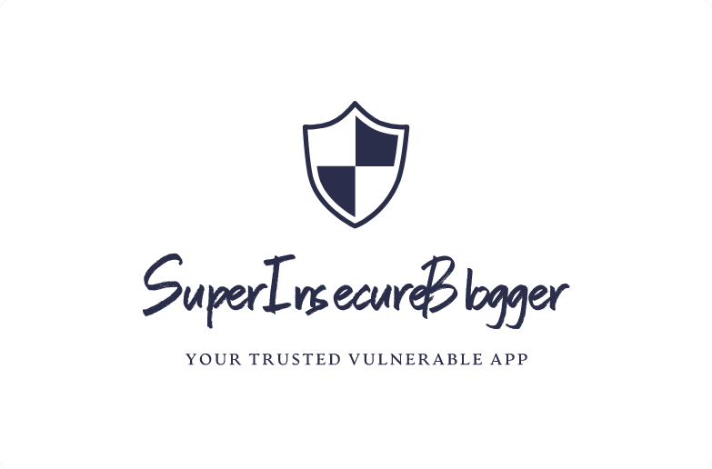
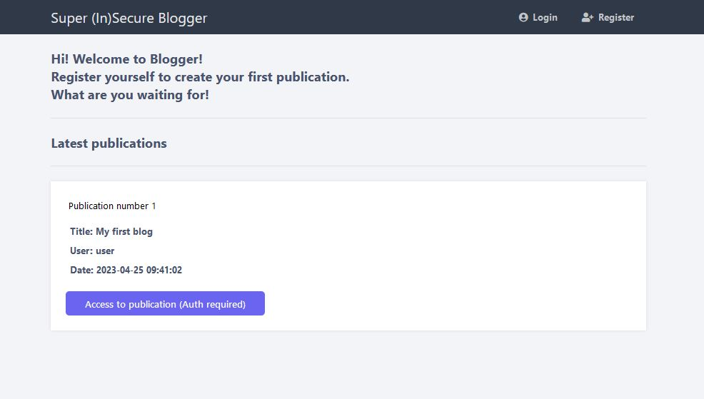
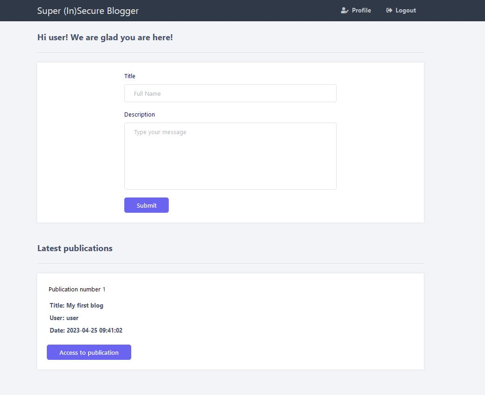
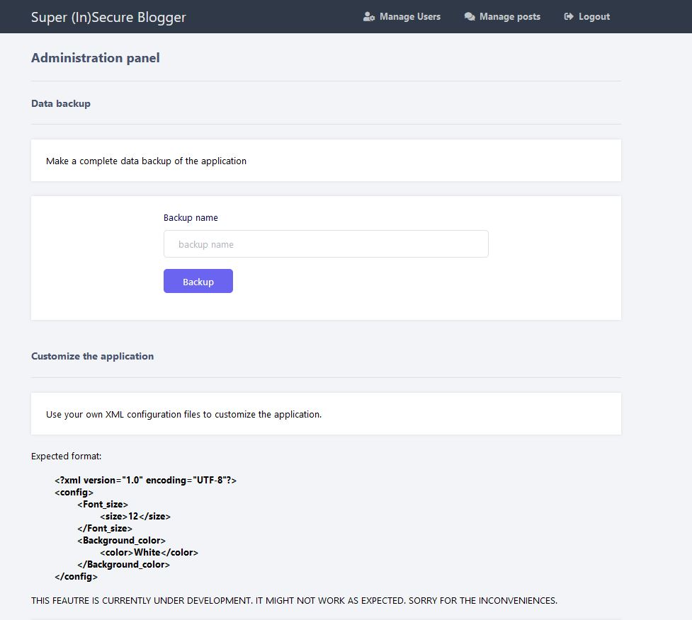

SuperInsecureBlogger is an educational application designed to help users understand and learn how to identify and exploit web vulnerabilities. It provides a simulated environment for practicing different types of attacks and learning how to defend against them.

SuperInsecureBlogger consists of two main components: an authentication API written in Python and a main application written in PHP. The authentication API handles user authentication and authorization, while the main application provides a blogging platform with various web vulnerabilities that users can exploit.

### Table of contents
* [Security disclaimer](#security_disclaimer)
* [Getting Started](#getting-started)
* [Installing](#installing)
* [Application architecture](#application_architecture)
* [Application preview](#application_preview)
* [Challenge](#challenge)
* [Vulnerabilites to exploit](#vulnerabilities_to_exploit)
* [Writeup](#writeup)
* [Support](#support)
* [Authors](#authors)
* [License](#license)

### Security disclaimer
SuperInsecureBlogger is not intended for production use and should only be used in a controlled environment for educational purposes. Deploying this application on a public-facing server could result in security vulnerabilities that could be exploited by attackers. Users should take appropriate precautions and use the application at their own risk.

### Getting Started
Before proceeding, please ensure that you have the following dependencies installed on your system:
* Docker Engine

### Installing
Once your system has the needed tools for execution, follow the steps below to get started:
1. Clone the repository to your local machine.
```bash
git clone https://github.com/adeiarias/SuperInsecureBlogger.git
```

2. Enter the downloaded folder.
```bash
cd SuperInsecureBlogger
```

3. Deploy the system running the `docker-compose` file.
```bash
docker-compose up -d
```

4. Enjoy :)

### Application architecture
* The authentication API is located at http://localhost:8000 and provides a RESTful interface that can be used to create, read and update user accounts.

* The /docs directory contains an OpenAPI specification for the authentication API that can be used to generate client code or documentation.

* The main application is located at http://localhost and provides a blogging platform with various web vulnerabilities that can be exploited.

* The main application uses MySQL as its backend database, while the authentication API uses MongoDB.

* To get started, log in to the main application, create an account and explore the different features and vulnerabilities that the application provides. Use caution when interacting with the application and be mindful of the potential security risks.

### Application preview
In the following images you can see a small preview of the application.







### Challenge
* I have added a flag to the main application container. It is located in the path /flag.txt. Will you be able to read it?

* By default, when a user is created, it has minimum privileges. Can you find a vulnerability that allows you to access the application as an administrator user?

### Vulnerabilities to exploit
The following list shows all the vulnerabilities present in the application.
* Insecure JWT
* Mass assignment
* User enumeration
* Insecure Direct Object Reference
* NoSQL injection
* Bruteforce attacks
* XSS
* Local File Inclusion + Log poisoning
* Unrestricted File Upload
* Server Side Template Injection
* OS injection
* XML External Entity
* SQL injection

### Writeup
Right now, there is no writeup available. In a near future a comprehensive writeup will be uploaded.

### Support
Independent developers may open bug reports or issues in the project's GitLab page, on the _Issues_ section.

I will be happy to review the different pull requests uploaded by users.

### Authors

Adei Arias – [adeiarias2000@gmail.com](mailto:adeiarias2000@gmail.com)

###  License
This project is licensed under the GNU General Public License v3.0 (GPLv3). The GPLv3 is a widely used open source license that ensures that the software remains free and open for others to use, modify, and distribute. By using and contributing to this project, you agree to comply with the terms and conditions of the GPLv3.

For further information on the terms and conditions of the GPLv3, please refer to the full text of the license, which is included in the `LICENSE.md` file in the root of this repository.